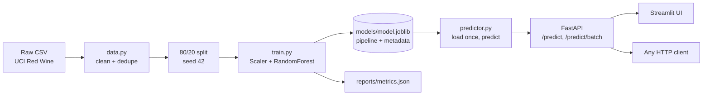

<div align="center">

# 🍷 Wine Quality API

**Predict the quality score (0 to 10) of a red wine from 11 lab measurements, served through a validated REST API, a Streamlit app and a Docker image.**


</div>

---

## 📑 Table of Contents

1. [Why This Exists](#-why-this-exists)
2. [Quickstart](#-quickstart)
3. [How It Works](#-how-it-works)
4. [Data and Model](#-data-and-model)
5. [Results](#-results)
6. [API Reference](#-api-reference)
7. [Streamlit App](#-streamlit-app)
8. [Docker](#-docker)
9. [Configuration](#%EF%B8%8F-configuration)
10. [Testing](#-testing)
11. [Repository Structure](#-repository-structure)
12. [Limitations](#%EF%B8%8F-limitations)
13. [Contributing and License](#-contributing-and-license)
14. [Citation](#-citation)

---

## 🎯 Why This Exists

Most wine-quality notebooks stop at a trained model and an accuracy number. This project covers the **whole path from raw CSV to a running service**, and the focus is on serving a model properly, not on squeezing out the last point of accuracy.

- **Leakage-aware data prep.** Duplicate rows are dropped *before* the train/test split, so identical wines cannot sit on both sides and inflate the score. The EDA notebook measures this effect.
- **Honest uncertainty.** Every prediction comes with a **10th to 90th percentile band** taken from the individual trees, so you can see how much the forest disagrees.
- **Out-of-range warnings.** A random forest cannot extrapolate. If an input falls outside what the model saw in training, the response says so.
- **Production habits.** Pydantic validation, startup model loading, a 503 when the model is missing, request IDs, request logging, structured JSON errors and a non-root Docker image.

> **Intuition:** think of the forest as 300 tasters who each studied a slightly different slice of the data. The *mean* of their votes is the score. The *spread* of their votes tells you how much to trust it.

---

## 🚀 Quickstart

Get a prediction in about a minute.

```bash
git clone <your-repo-url>
cd wine-quality-api

python -m venv .venv
source .venv/bin/activate        # Windows: .venv\Scripts\activate

pip install -e ".[dev]"
python -m wine_api.train         # writes models/model.joblib and reports/metrics.json
```

Start the API and the UI in two terminals:

```bash
# Terminal 1: API
uvicorn wine_api.api.main:app --port 8000

# Terminal 2: UI
streamlit run src/wine_api/ui.py
```

| Service | URL |
|---|---|
| Interactive API docs | http://localhost:8000/docs |
| Streamlit app | http://localhost:8501 |

Try it straight from the terminal:

```bash
curl -X POST localhost:8000/predict -H 'content-type: application/json' -d '{
  "fixed_acidity": 7.9, "volatile_acidity": 0.35, "citric_acid": 0.46,
  "residual_sugar": 3.6, "chlorides": 0.078, "free_sulfur_dioxide": 15,
  "total_sulfur_dioxide": 37, "density": 0.9973, "pH": 3.35,
  "sulphates": 0.86, "alcohol": 12.8
}'
```

---

## 🧠 How It Works

### Pipeline at a glance



### Step by step

| Step | Module | What happens |
|---|---|---|
| 1. Load and clean | `data.py` | Column names are stripped and converted to snake case. Duplicate rows and rows with missing values are dropped. |
| 2. Split | `train.py` | 80/20 split with seed 42: **1087 training rows, 272 test rows**. |
| 3. Train | `train.py` | `StandardScaler` followed by a 300-tree `RandomForestRegressor`. |
| 4. Save | `train.py` | One artifact holds the fitted pipeline, feature list, version, test metrics and per-feature training ranges. |
| 5. Serve | `predictor.py` | The artifact loads once at startup. Single and batch requests share one vectorised code path. |
| 6. Expose | `api/` | FastAPI validates input, calls the predictor and returns a typed response. |
| 7. Explore | `ui.py` | Streamlit talks to the API over HTTP, so it works against a local or a containerised backend. |

### Tech stack

| Layer | Tools |
|---|---|
| Modelling | scikit-learn, pandas, joblib |
| API | FastAPI, Pydantic, Uvicorn |
| UI | Streamlit |
| Quality | pytest, httpx, ruff |
| Packaging | `pyproject.toml`, Docker (`python:3.12-slim`) |

---

## 📚 Data and Model

### Dataset

| Property | Detail |
|---|---|
| Source | UCI Red Wine Quality (Cortez et al., 2009), stored in `data/raw/` with its description file |
| Features | 11 lab measurements (listed below) |
| Target | `quality`, an integer score from tasters. Almost all values are **5 or 6**. |
| Cleaning | Snake-case column names, duplicates removed, missing rows removed |
| Split | 80/20, seed 42 (1087 train / 272 test) |

<details>
<summary><b>The 11 input features</b></summary>

`fixed_acidity`, `volatile_acidity`, `citric_acid`, `residual_sugar`, `chlorides`, `free_sulfur_dioxide`, `total_sulfur_dioxide`, `density`, `pH`, `sulphates`, `alcohol`

Each one has a description, a unit and an example in the auto-generated docs at `/docs`.

</details>

### EDA notebook

`notebooks/eda.ipynb` covers duplicates, the quality distribution and the correlations with quality. It includes a **leakage check** that compares R² with and without duplicates. It ends with the modelling decisions:

- Treat the problem as **regression** (the data has no categories, only a 0 to 10 score)
- Use **all 11 features**
- **Drop duplicates** before splitting
- Judge the model against a **mean-prediction baseline**

### Model

| Property | Value |
|---|---|
| Pipeline | `StandardScaler` into `RandomForestRegressor` |
| Trees | 300 |
| Artifact | `models/model.joblib` (pipeline, features, version, metrics, training ranges) |
| Metrics file | `reports/metrics.json` |

---

## 📊 Results

Held-out test set: **272 rows**, after dropping duplicates.

| Metric | Value |
|---|---|
| **MAE** | **0.467** |
| MAE of predicting the training mean (baseline) | 0.705 |
| RMSE | 0.619 |
| **R²** | **0.459** |
| Predictions within 0.5 of the true score | 64% |

The model cuts the error by about **one third** compared with the baseline (0.467 vs 0.705).

> **Why is R² only 0.46?** That is normal for this dataset. Scores are coarse integers, almost all of them 5 or 6, and two wines with identical measurements can get different scores from different tasters. Use the output as a **rough estimate**, not a verdict.

---

## 🔌 API Reference

### Endpoints

| Method | Path | Purpose |
|---|---|---|
| `GET` | `/health` | Status and model version |
| `GET` | `/model-info` | Features, test metrics, training ranges, feature importances |
| `POST` | `/predict` | Predict one wine |
| `POST` | `/predict/batch` | Predict 1 to 100 wines in one call |

`GET /` redirects to `/docs`.

### Example response

```json
{
  "quality": 7.53,
  "rounded_quality": 8,
  "category": "high",
  "low": 7.0,
  "high": 8.0,
  "warnings": [],
  "model_version": "0.1.0"
}
```

### Response fields

| Field | Meaning |
|---|---|
| `quality` | Mean prediction over all trees |
| `rounded_quality` | `quality` rounded to the nearest integer |
| `category` | `low` for a rounded score of 4 or less, `average` for 5 to 6, `high` for 7 or more |
| `low` / `high` | 10th and 90th percentile of the individual tree predictions. They show how much the trees disagree and are **not** a calibrated confidence interval. |
| `warnings` | Inputs outside the range seen in training. Predictions for those inputs are unreliable. |
| `model_version` | Version stored in the model artifact |

> `warnings` needs a model trained with the current `train.py`, because that version stores the training ranges. If you have an older `model.joblib`, retrain.

### Batch request

`POST /predict/batch` accepts a JSON list of 1 to 100 wines, each shaped like the single `/predict` body.

### Validation and errors

| Situation | Behaviour |
|---|---|
| Value outside the allowed bounds | `422` with the failing field |
| Unknown field in the body | Rejected with `422` |
| Model file missing at startup | App fails fast and prints `python -m wine_api.train` |
| Model not loaded at request time | `503` from the injected dependency |
| Unhandled exception | Clean JSON error response |

### Operations

- Model loads once at startup through a FastAPI **lifespan** handler
- Every request is logged with method, path, status and latency
- Every response carries an **`X-Request-ID`** header
- CORS is enabled (configurable)

---

## 🖥️ Streamlit App

The UI talks to the API over HTTP, so it works with a local or a containerised backend.

| Tab | What you get |
|---|---|
| **Predict** | One slider per feature, three presets from real dataset rows (scored 3, 5 and 8), and a prediction that updates on every change. Shows the score, a progress bar, the category, the likely range and any out-of-range warnings. |
| **Batch** | Upload a CSV (comma or semicolon separated, spaces or underscores in column names). Rows are sent to `/predict/batch` in chunks of 100 and the result downloads as a CSV. |
| **Model** | Test metrics and a feature-importance chart. |

The **sidebar** holds the API URL (default `http://localhost:8000`) and a connection status indicator.

---

## 🐳 Docker

One image runs both apps. It **trains the model during the build**, so the saved model always matches the scikit-learn version inside the image. It runs as a **non-root user**.

```bash
docker build -t wine-quality-api .
docker network create wine

# API (default command)
docker run -d --name wine-api --network wine -p 8000:8000 wine-quality-api

# UI (same image, different command)
docker run -d --name wine-ui --network wine -p 8501:8501 \
  -e APP_API_URL=http://wine-api:8000 \
  wine-quality-api streamlit run src/wine_api/ui.py --server.address 0.0.0.0
```

Then open http://localhost:8501 for the UI or http://localhost:8000/docs for the API.

`.dockerignore` keeps caches, the environment file and the model file out of the build context.

---

## ⚙️ Configuration

Settings come from `APP_*` environment variables or a `.env` file. Copy `.env.example` to start.

| Variable | Default | Purpose |
|---|---|---|
| `APP_DATA_PATH` | `data/raw/winequality-red.csv` | Training data location |
| `APP_MODEL_PATH` | `models/model.joblib` | Where the model is saved and loaded |
| `APP_METRICS_PATH` | `reports/metrics.json` | Where test metrics are written |
| `APP_CORS_ORIGINS` | `["*"]` (JSON list) | Allowed CORS origins |
| `APP_API_URL` | `http://localhost:8000` | API address used by the UI |

---

## ✅ Testing

```bash
pytest
```

**14 tests** in three groups:

| Group | Approach | Covers |
|---|---|---|
| **API** | Runs against a **fake predictor**, so no trained model is needed | Health, the 503 case, predict, validation, batch limits, model info |
| **Predictor** | Trains a tiny model on random data | Save/load round trip, the prediction band, range warnings, importance ordering, missing-file error |
| **Data** | Small pandas fixtures | Column renaming, duplicate removal |

Lint with:

```bash
ruff check .
```

---

## 🗂️ Repository Structure

```text
wine-quality-api/
├── data/raw/                 UCI csv and its description file
├── models/model.joblib       trained pipeline plus metadata (git-ignored)
├── reports/metrics.json      test metrics
├── notebooks/eda.ipynb       EDA and leakage check
├── src/wine_api/
│   ├── api/                  FastAPI app (main, routes, schemas)
│   ├── config.py             settings from APP_* env vars or .env
│   ├── data.py               loading and cleaning
│   ├── predictor.py          model loading and inference
│   ├── train.py              training script
│   └── ui.py                 Streamlit app
├── tests/                    API, predictor and data tests
├── Dockerfile                one image for API and UI
├── pyproject.toml            package metadata, dev extras, pytest and ruff config
└── .env.example              template for APP_* settings
```

---

## ⚠️ Limitations

- **Rough estimates only.** Taster scores are subjective and noisy, so R² tops out well below 1 on this data.
- **Narrow target range.** Almost every training score is 5 or 6, so extreme scores (3 or 8) are predicted less reliably.
- **No extrapolation.** Random forests cannot predict outside what they saw. Heed the `warnings` field.
- **Band is not a confidence interval.** `low` and `high` measure tree disagreement, not calibrated probability.
- **Red wine only.** The model was trained on red wine and should not be used for white wine.

---

## 🤝 Contributing and License

Issues and pull requests are welcome.

1. Fork the repo and create a feature branch
2. Install with `pip install -e ".[dev]"`
3. Run `pytest` and `ruff check .` before opening a PR
4. Describe what changed and why

License: add your chosen license here (for example MIT) and include a `LICENSE` file in the repo root.

---

## 📖 Citation

Dataset: P. Cortez, A. Cerdeira, F. Almeida, T. Matos and J. Reis. *Modeling wine preferences by data mining from physicochemical properties.* Decision Support Systems, 47(4):547-553, 2009.
